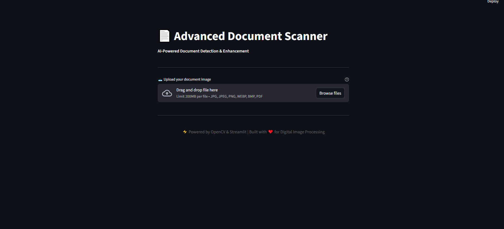
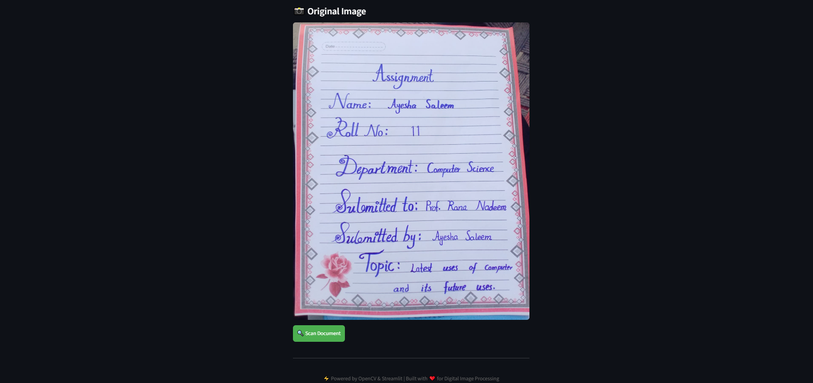
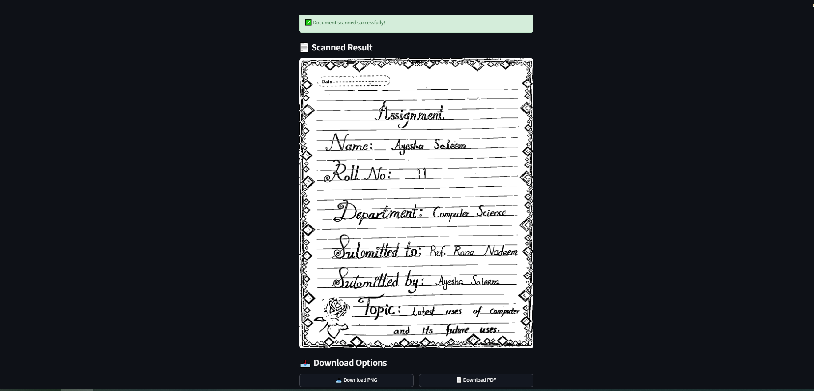
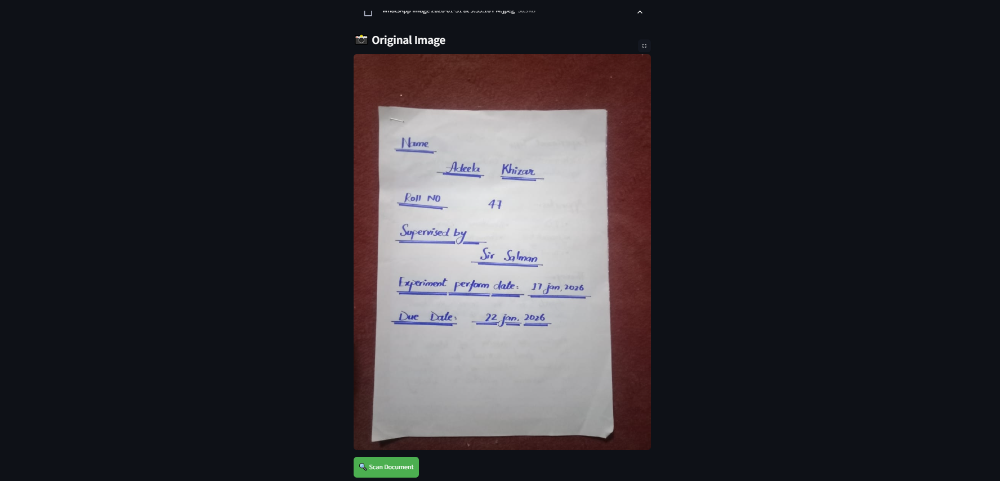
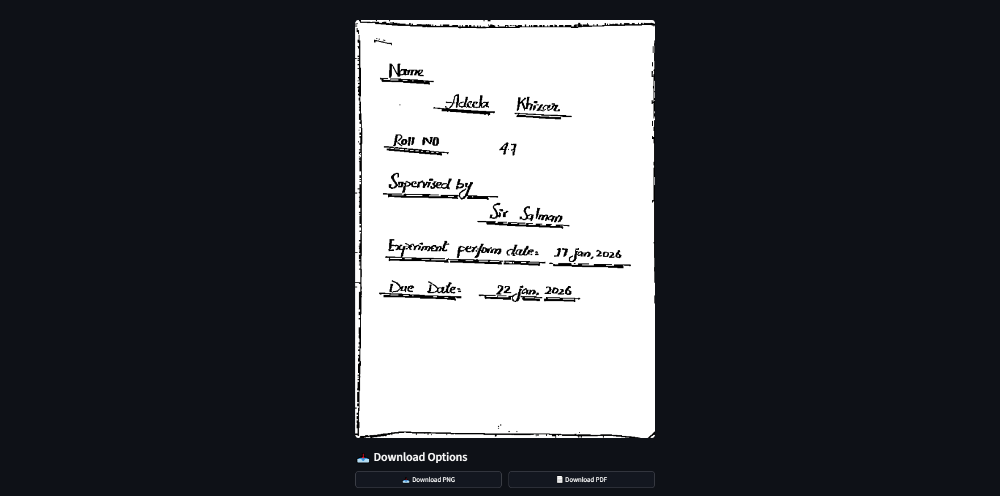

# Advanced Document Scanner
Developers:
1. Ayesha Saleem - 100048
2. Rubina Bibi - 100069

A comprehensive image processing application that converts regular document photos into professional scanned documents using computer vision algorithms. Built with Python, OpenCV, and Streamlit, this project demonstrates modern document processing techniques with an interactive web interface.

---

## Overview

This project provides a user-friendly web application for converting document images into high-quality scanned documents. The application uses advanced computer vision algorithms to automatically detect document boundaries, correct perspective distortion, and enhance text clarity. It supports both individual downloads and batch processing with multiple export formats.

---

## Features Demonstrated

### Document Processing Techniques
- **Edge Detection** - Multiple methods (Canny, adaptive thresholding, morphological gradient, Sobel) for robust contour detection
- **Perspective Correction** - Four-point perspective warping to straighten skewed documents
- **Image Enhancement** - CLAHE contrast enhancement, denoising, sharpening, and adaptive binarization
- **Contour Analysis** - Advanced filtering and ranking of detected document boundaries
- **Multi-Format Export** - High-quality PNG and PDF outputs with customizable settings

### Application Features
- **Image Upload** - Support for JPG, JPEG, PNG, WEBP, BMP, PDF formats
- **Real-time Processing** - Instant conversion with progress indicators
- **Individual Downloads** - Save scanned documents as PNG or PDF files
- **Batch Export** - Download processed documents in multiple formats
- **Side-by-side Comparison** - View original and scanned images simultaneously
- **Responsive Design** - Mobile-friendly web interface with Streamlit

---

## Project Structure

```
Document_Scanner/
├── document_scanner_web.py    # Main Streamlit web application
├── my_document_scanner.ipynb  # Jupyter notebook with detailed analysis
├── README.md                  # Project documentation
└── test/                      # Sample test images
    ├── image_1.png
    ├── image_2.png
    ├── image_3.png
    ├── image_4.png
    └── image_5.png
```

---

## Technical Requirements

- **Python:** 3.7+
- **OpenCV (cv2):** 4.5+
- **Streamlit:** 1.0+
- **NumPy:** 1.19+
- **Pillow (PIL):** 8.0+
- **Operating System:** Windows, macOS, or Linux

---

## Installation & Setup

### 1. Clone/Download the Project
```bash
cd "Document_Scanner"
```

### 2. Install Dependencies
```bash
pip install -r requirements.txt
```

Or install manually:
```bash
pip install streamlit opencv-python numpy pillow
```

### 3. Run the Application
```bash
streamlit run document_scanner_web.py
```

The application will open in your default browser at `http://localhost:8501`

---

## Usage Guide

### Web Application (Streamlit)
1. **Launch** - Run the command above to start the web app
2. **Upload** - Click the upload area to select a document image from your device
3. **Convert** - Click the "Scan Document" button
4. **View Results** - See the original and scanned document side-by-side
5. **Download** - Download the scanned result as PNG or PDF

### Jupyter Notebook
1. Open `my_document_scanner.ipynb` in Jupyter Notebook or JupyterLab
2. Run cells sequentially to process images step-by-step
3. Modify image paths as needed
4. View detailed explanations and intermediate results

---

## Testing & Demonstration

### Test Images Included
Sample images are provided in the `test/` folder for quick testing:

**Image 1 - Test Sample 1**


Processing through document detection and enhancement algorithms.

---

**Image 2 - Test Sample 2**


Demonstrates the algorithm's effectiveness across different document types.

---

**Image 3 - Test Sample 3**


Shows consistent quality across varied document orientations and lighting.

---

**Image 4 - Test Sample 4**


Additional test case for robustness verification.

---

**Image 5 - Test Sample 5**


Final test sample demonstrating comprehensive processing capabilities.

---

## Core Algorithm Details

### Key Computer Vision Concepts

**1. Contour Detection**
- Identifies document boundaries using multiple edge detection methods
- Filters contours by area, aspect ratio, and rectangular shape
- Ensures reliable detection across various document types

**2. Perspective Transformation**
- Calculates optimal transformation matrix from four corner points
- Warps image to remove perspective distortion
- Maintains document proportions and readability

**3. Image Enhancement**
- Applies CLAHE for contrast improvement
- Uses non-local means denoising for noise reduction
- Implements adaptive thresholding for text binarization

**4. Morphological Operations**
- Cleans up detected edges with closing operations
- Removes small artifacts while preserving document structure
- Improves overall contour accuracy

---

## Performance Metrics

- **Processing Speed:** 2-5 seconds per image (depends on image size and complexity)
- **Supported Image Sizes:** Up to 4K resolution (4096x2160)
- **Memory Usage:** Efficient handling with OpenCV and NumPy operations
- **Output Format:** High-quality PNG and PDF files

---

## Output Quality

All scanned documents maintain:
- ✅ Original text content and formatting
- ✅ Enhanced readability with improved contrast
- ✅ Straightened perspective for professional appearance
- ✅ Noise reduction while preserving important details
- ✅ Lossless compression for archival quality

---

## Verification Checklist

- ✅ Web application launches without errors
- ✅ Image upload functionality works correctly
- ✅ Document detection processes successfully
- ✅ Perspective correction applies accurately
- ✅ Image enhancement improves text clarity
- ✅ Individual downloads generate proper files
- ✅ Test images process without crashes
- ✅ No runtime errors or exceptions
- ✅ Processing completes within reasonable time

---

## File Format Support

### Supported Input Formats
- `.jpg` / `.jpeg` - Standard JPEG images
- `.png` - Portable Network Graphics
- `.webp` - Modern web image format
- `.bmp` - Bitmap images
- `.pdf` - PDF documents (single page)

### Output Formats
- `.png` - Lossless PNG format for scanned images
- `.pdf` - PDF format for document preservation

---

## Development Notes

### Code Architecture
- **Modular Design** - Separate functions for detection, transformation, and enhancement
- **Clean Separation** - UI logic isolated from processing logic
- **Resource Management** - Efficient memory usage with streaming
- **Error Handling** - Graceful handling of invalid inputs and detection failures

### Dependencies
- `streamlit` - Web framework and UI components
- `opencv-python` - Image processing algorithms
- `pillow` - Image I/O and conversion
- `numpy` - Numerical array operations

---

## Educational Value

This project demonstrates:
- Computer vision fundamentals for document processing
- Image processing and enhancement techniques
- Python application development
- Web application creation with Streamlit
- Algorithm implementation and optimization
- UI/UX design principles for technical tools

---

## License

Educational project - For learning and demonstration purposes.

---

- **Python**: 3.7+
- **Streamlit**: 1.0+
- **OpenCV**: 4.5+
- **NumPy**: 1.19+
- **Pillow**: 8.0+

## Tips for Best Results

### Photography Tips
- **Positioning**: Hold camera directly above the document
- **Lighting**: Use even, diffuse lighting without harsh shadows
- **Background**: Choose a contrasting background color
- **Focus**: Ensure the entire document is in focus
- **Stability**: Keep camera steady to avoid motion blur

### Document Preparation
- **Flatness**: Lay documents completely flat
- **Corners**: Ensure all four corners are visible
- **Coverage**: Fill 50-80% of the frame
- **Surface**: Avoid glossy paper that causes reflections
- **Size**: Minimum document size should be 2x2 inches

### Troubleshooting
If detection fails:
- Try different lighting conditions
- Adjust camera angle
- Clean the document surface
- Use a plain background
- Ensure good contrast between document and background

## Contributing

Contributions are welcome! Please feel free to submit a Pull Request.

1. Fork the repository
2. Create a feature branch (`git checkout -b feature/AmazingFeature`)
3. Commit your changes (`git commit -m 'Add some AmazingFeature'`)
4. Push to the branch (`git push origin feature/AmazingFeature`)
5. Open a Pull Request

## License

This project is licensed under the MIT License - see the [LICENSE](LICENSE) file for details.

##  Acknowledgments

- Built with [Streamlit](https://streamlit.io/)
- Powered by [OpenCV](https://opencv.org/)
- Inspired by various computer vision research papers

##  Support

If you encounter any issues or have questions, please open an issue on GitHub.
